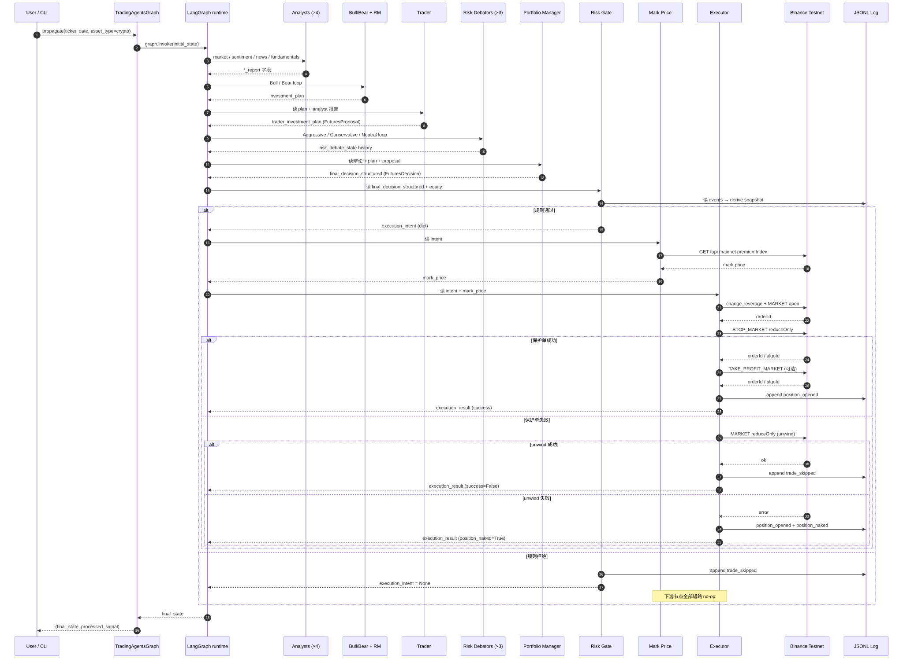

# Monopoly Trading Agent 代码走读

> **基准**：`dev` 分支 @ `08e3024`（PLAN.md T0–T12 已合并 + crypto-only 重构：stock 路径已整体移除）  
> **生成日期**：2026-06-24 · **更新**：2026-07-19（T1–T4 同步）· **2026-07-23**（crypto-only 重构：`asset_type` 分流、Fundamentals analyst、stock schemas 全删；反思层改 Binance K线）· **2026-08-02**（T5–T7 状态修正；T9–T11 数据源增强；T12 对账闭环：intent write-ahead + 双向对账 + 真实 PnL 回填）  
> **读者画像**：熟悉 Python，但**未读过 LangGraph 文档**

---

## 0. 怎么读这份文档

本文按"自顶向下，再自底向上"的顺序展开：

1. **LangGraph 速通**（§1）——你不需要完整看官方文档，掌握本节几个核心概念就够看懂全部代码。
2. **系统鸟瞰**（§2）——Monopoly 的两层风控设计哲学 + 完整决策图。
3. **入口与生命周期**（§3）——从 `main.py` 到一次完整 run 的代码路径。
4. **状态对象**（§4）——LangGraph 里所有节点共享的"信使" `AgentState`。
5. **图拓扑**（§5）——四张 mermaid 图，分别展开 analyst 自循环、研究员辩论、风险辩论、futures tail。
6. **节点详读**（§6–§10）——按图的执行顺序逐节点讲。
7. **横切关注点**（§11）——structured output、JSONL 事件日志。
8. **上线前盲点**（§12）——已修复 / 未修复对照表。
9. **LangGraph 文档链接**（§13）。

所有代码引用格式：`path/to/file.py:LINE` 或 `:LINE-LINE`。

---

## 1. LangGraph 速通

[LangGraph](https://langchain-ai.github.io/langgraph/) 是 LangChain 团队推出的"用图结构编排 LLM agent"的库。它解决一个具体问题：当一个 agent 需要**多轮工具调用 + 多个子 agent 协作 + 有状态共享 + 可恢复**时，普通的 Python 函数链不够。LangGraph 把这种工作流抽象成一张有向图（带循环），节点是函数，状态在节点间流动。

### 1.1 五个必须懂的概念

#### 1.1.1 StateGraph

[`StateGraph`](https://langchain-ai.github.io/langgraph/concepts/low_level/#stategraph) 是顶层构造器。声明一个 state schema（一般是 `TypedDict`），然后往里加节点、加边、加条件边、编译。

```python
from langgraph.graph import StateGraph, START, END
workflow = StateGraph(AgentState)
workflow.add_node("Bull Researcher", bull_node_fn)
workflow.add_node("Bear Researcher", bear_node_fn)
workflow.add_edge(START, "Bull Researcher")
workflow.add_conditional_edges("Bull Researcher", router_fn, {...})
graph = workflow.compile()
```

#### 1.1.2 State + Reducer

[State](https://langchain-ai.github.io/langgraph/concepts/low_level/#state) 是流经图的字典对象。每个节点接收当前 state，返回一个**部分 dict**，LangGraph 把它和当前 state 合并。

合并方式由字段的 **reducer** 决定：

- 不指定 reducer → **直接覆盖**（你 return 这个字段就替换旧值）。
- `Annotated[list, operator.add]` → 列表追加。
- `Annotated[list[Message], add_messages]` → 消息列表用 LangGraph 的智能合并器（去重、按 id 替换）。

Monopoly 的 `AgentState`（§4）大量使用"直接覆盖"模式：每个节点写自己负责的字段，互不重叠。

#### 1.1.3 节点（Node）

节点就是普通 Python 函数，签名 `def node(state) -> dict`。返回值是 state 的部分更新。

```python
def my_node(state):
    last_msg = state["messages"][-1]
    return {"my_report": f"Processed {last_msg}"}
```

LangGraph 自动调度：根据边的连接，决定哪个节点接力。

#### 1.1.4 条件边（Conditional Edges）

[条件边](https://langchain-ai.github.io/langgraph/how-tos/branching/) 是路由函数：接收 state，返回**下一个节点的名字**。

```python
def router(state) -> str:
    if state["count"] > 3:
        return "Manager"
    return "KeepDebating"

workflow.add_conditional_edges("Bull", router, {
    "Manager": "Research Manager",
    "KeepDebating": "Bear",
})
```

Monopoly 用条件边实现三种循环：① analyst ↔ ToolNode 工具调用循环，② Bull/Bear 辩论循环，③ 三方风险辩论循环。

#### 1.1.5 ToolNode

[`ToolNode`](https://langchain-ai.github.io/langgraph/reference/agents/#langgraph.prebuilt.tool_node.ToolNode) 是 LangGraph 内置的"工具执行器"。给它一组 `@tool` 装饰的函数：

```python
tool_node = ToolNode([get_market_data, get_news])
workflow.add_node("tools_market", tool_node)
```

LangGraph 会自动：检查 `messages[-1].tool_calls` → 调对应工具 → 把结果包成 `ToolMessage` 追加进 `messages`。

### 1.2 MessagesState 与消息合并

[`MessagesState`](https://langchain-ai.github.io/langgraph/concepts/low_level/#messagesstate) 是一个预置的 TypedDict 子类，自带：

```python
messages: Annotated[list[AnyMessage], add_messages]
```

[`add_messages`](https://langchain-ai.github.io/langgraph/reference/graphs/#langgraph.graph.message.add_messages) reducer 会：
- 节点返回的 `{"messages": [new_msg]}` 自动追加到现有列表
- 如果新消息 id 已存在，替换而非重复

Monopoly 的 `AgentState` 继承 `MessagesState`，所以你看到很多节点返回 `{"messages": [AIMessage(...)]}`——这是在追加，不是覆盖。

### 1.3 编译与执行

`workflow.compile()` 把图固化成可执行对象。运行有两种姿势：

- `graph.invoke(initial_state, config={...})` —— 一把跑到 END，返回最终 state。
- `graph.stream(initial_state, config={...})` —— 每个节点完成时 yield 一个增量 chunk。Monopoly 在 `debug=True` 时用这个，便于打印中间态。

### 1.4 Checkpointer（持久化）

[Checkpointer](https://langchain-ai.github.io/langgraph/concepts/persistence/) 让图能**中断后恢复**。常用的是 `SqliteSaver`：

```python
from langgraph.checkpoint.sqlite import SqliteSaver
saver = SqliteSaver.from_conn_string("checkpoints.db")
graph = workflow.compile(checkpointer=saver)
graph.invoke(state, config={"configurable": {"thread_id": "run-001"}})
```

每个节点完成后，state 被序列化进 SQLite，按 `thread_id` 索引。下次用同 `thread_id` 调用，会从最近的检查点续跑。Monopoly 把 `thread_id` 设成 `f"{ticker}-{trade_date}"`——同 ticker 同日的 run 会续跑，换日就是新 thread。

### 1.5 与 LangChain 的关系

LangChain 提供 `BaseChatModel`、`@tool` 装饰器、`with_structured_output` 等"模型层"原语；LangGraph 提供"编排层"。Monopoly 用 LangChain 来 bind LLM 和 schema，用 LangGraph 来串编排——两者各管一摊。

---

## 2. 系统鸟瞰

### 2.1 Monopoly 是什么

Monopoly 是 [TauricResearch/TradingAgents](https://github.com/TauricResearch/TradingAgents) 的 fork，把目标从美股改成 **Binance 永续合约**。整体哲学（spec §1.2）：

> **LLM 只分析、不下单。每笔订单必须经过：（a）硬编码风控门 + （b）Discord 人工确认（OpenClaw bot）。**

人工确认的 Monopoly 侧已完成（T5，2026-07-19：`cli/main.py trade_execute` + `futures/approval.py`，§10.6）——审批语义是「`--approved` + `--approved-by` 双标志缺一即拒、15 分钟 staleness 自动过期、执行前 gate 复评」。**尚未完成的是 OpenClaw/Discord 侧的部署与端到端验证（PLAN.md 手工验证清单第 4 项）——跑通前 executor 保持 dryrun/testnet，不切 mainnet**。

代码里的体现是 §10 的 futures tail——一段确定性的 Python 代码守在 LLM 决策和 Binance API 之间。

### 2.2 全图鸟瞰

整体 LangGraph 图分两段：

- **主链**（crypto-only，2026-07-23 起唯一模式）：3 个 analyst（market / social / news）→ Bull/Bear 辩论 → Research Manager → Trader → 三方风险辩论 → Portfolio Manager。
- **Futures tail**：Risk Gate → Mark Price → Executor。PM 无条件接入（不再有 asset_type 分流；`config=None` 的测试图除外）。



### 2.3 两层风控

| 层 | 实现 | 性质 | 谁能改 |
|---|---|---|---|
| L1 | PM prompt 教学（`portfolio_manager.py:159-208`） | LLM 自律 | LLM 自己 |
| L2 | Schema `Field(description=...)`（`schemas.py:371-381`） | LLM 自律 | 提示工程 |
| L3 | `risk_gate.evaluate`（`risk_gate.py:149-296`） | **硬编码** | 仅代码改 |
| L4 | 持仓对账（`position_monitor.py`，§10.5，T12 起双向对账 + 真实 PnL 回填）+ 异常告警（`alerts.py`，§10.7，T6） | 运维侧 | — |

**关键设计选择**：L2 的 Field constraint **不是 Pydantic 的 `le=0.01` 这种硬约束**，只是 description 里的自然语言。原因：Pydantic 硬约束会让 `structured_output` 调用抛 `ValidationError`，触发 free-text fallback，反而失去结构化重试。决策放在 L3。

---

## 3. 入口与生命周期

### 3.1 进程入口

两个入口：

- `main.py` —— 程序化入口，示例 ticker `BTC-USD`。
- `cli/main.py` —— CLI 入口。ticker 用 `to_binance_symbol` 校验，只接受 crypto perp 形式（`BTC-USD` / `BTCUSDT`），非 crypto 输入直接拒绝。

### 3.2 `TradingAgentsGraph.__init__` —— `tradingagents/graph/trading_graph.py:55-137`

构造函数做 9 件事，按顺序：

1. **`self.config = config or DEFAULT_CONFIG`**（line 71）。
2. **`set_config(self.config)`**（line 75）—— 注入 dataflows 全局态，让数据源 fetcher 共享同一份配置。**这是全局可变状态**，多实例并跑时要小心。
3. **创建缓存/结果目录**（line 78-79）。
4. **构造两个 LLM**（line 88-99）——`deep_thinking_llm`（用于 Research Manager、Portfolio Manager）和 `quick_thinking_llm`（用于 analysts、debators、Trader）。provider 由 `config["llm_provider"]` 决定，工厂在 `llm_clients/factory.py`。
5. **`TradingMemoryLog`**（line 104）—— 跨 run 反思记忆。
6. **工具节点**（line 107，`_create_tool_nodes` line 161-197）—— 每个 analyst 对应一组 LangChain `@tool`，被包成 LangGraph `ToolNode`。`social` analyst 只有 `get_news`；X/Twitter 信号不走工具，而是在 sentiment analyst 节点内直接调 `crypto_twitter.get_tweets` 注入 prompt 的 `twitter_block`（T10 起为快讯台编辑转述，非原始推文，§6）。Reddit 侧完整降级链：OAuth（需凭证，T3b）→ www/old `.json` → `search.rss` → `new.rss`+客户端过滤 → `data_gap`。2026-07 实况：DC IP 的匿名 `.json` 被 Reddit 封锁，RSS 未封——数据经 RSS 恢复，但 RSS 无 score/评论数，engagement 字段为 0。
7. **`ConditionalLogic`**（line 110-113）—— debate 循环的路由器。
8. **`GraphSetup.setup_graph(selected_analysts)`**（line 135）—— 构图（§5 详解）。
9. **`workflow.compile()`**（line 136）—— 编译。

### 3.3 `propagate` —— `trading_graph.py:300-339`

```python
def propagate(self, company_name, trade_date):
```

（2026-07-23 起 `asset_type` 参数已删除——所有 run 都是 crypto，futures tail 恒触发。）

执行序：

1. **`_resolve_pending_entries`**（line 313）—— 把上一次同 ticker 的 pending decision（还没"知道结果"的）拉出来，用 **Binance 日线**（`crypto_binance.get_ohlcv_bars`，经 `to_binance_symbol` 转换）查持仓后 N 天的 raw/alpha return，扔给 reflector 生成反思，回写 memory log。alpha 基准是 `config["benchmark_ticker"]`（默认 `BTC-USD`，spec §2.1）；crypto 全年连续交易，holding days 与自然日 1:1。
2. **checkpointer 可选启用**（line 316-321）—— 如果 `config["checkpoint_enabled"]`，用 `SqliteSaver` 持久化中间态。
3. **`_run_graph`**（line 334）—— 真正跑图。
4. **`finally`**（line 335-339）—— 退出 checkpointer 上下文，**重新编译一份无 checkpointer 的 graph**，避免下次调用复用脏状态。

### 3.4 `_run_graph` —— `trading_graph.py:341-390`

```python
init_agent_state = self.propagator.create_initial_state(
    company_name, trade_date, past_context=past_context
)
```

`create_initial_state`（`propagation.py:18-60`）只填了空字符串的报告槽位、空的 debate 状态、`messages=[("human", company_name)]`。**futures tail 用到的字段（`final_decision_structured`、`mark_price`、`execution_intent`、`execution_result`、`risk_gate_rejection_reason`、`equity_usd`）从未在初始化时填入**。

这意味着：
- gate 节点用 `state.get("equity_usd", starting_equity)` 兜底（`risk_gate.py:309`，默认 1000 USD）
- executor 节点同样兜底（`executor.py:567`）
- **当前没有任何代码动态把"账户实际余额"塞进 state**——所有 run 都按 starting_equity=1000 算 sizing。这是个 Week 5 OpenClaw 需要补的洞。

后续：
- `debug=True` 用 `graph.stream`（line 357），每节点一个 chunk，便于看中间态。
- 非 debug 用 `graph.invoke`（line 369），一把跑到底。
- `_log_state`（line 392-432）—— 把 final_state 落 `results_dir/{ticker}/TradingAgentsStrategy_logs/full_states_log_{date}.json`，**但只 dump 决策链字段**，没有 dump `execution_result` / `execution_intent` / `risk_gate_rejection_reason`。**执行明细只在 JSONL event log 里**，复盘时要同时查 JSON（决策）+ JSONL（执行）。

### 3.5 checkpointer 的 thread_id 规则

`trading_graph.py:351-353`：

```python
tid = thread_id(company_name, str(trade_date))
args["config"]["configurable"]["thread_id"] = tid
```

`thread_id` 函数（`graph/checkpointer.py`）把 ticker + date 拼成稳定 id。同 ticker 同日的 run 续跑，换日就是新 thread——**回测时按日重跑是天然新 thread，不会续旧检查点**（重放路径还多一层保险：`backtest/replay.py:93` 强制 `checkpoint_enabled: False`，且在合并外部 config 之后才置，传入 True 也会被压回）。

**已知缺口（2026-08-09 上游对照发现，未移植）**：thread_id 只含 ticker+date，**不含运行签名**（analyst 组合、辩论深度、asset mode）。checkpoint 又只在成功完成时清除（`trading_graph.py:359`），失败 run 的中间态会留在 per-ticker sqlite 里——同日崩溃后改配置重跑，会**静默 resume 旧图状态**，产出新旧配置杂交的 decision，日志上不可见。当前为潜伏风险：`checkpoint_enabled` 默认 False、`.env` 未开启、replay 强制关闭。**开启 checkpoint 之前必须先移植 upstream `daf1da9`**（把运行签名折进 thread_id，同 commit 还暴露了 `llm_max_retries`）。见 §12 #8。

---

## 4. 状态对象 `AgentState`

文件：`tradingagents/agents/utils/agent_states.py`。

### 4.1 类型本质

```python
class AgentState(MessagesState):
    company_of_interest: Annotated[str, "..."]  # perp-futures pair, e.g. BTC-USD
    # ...
```

继承 `langgraph.graph.MessagesState`，所以**自带 `messages` 字段 + `add_messages` reducer**。其余字段都用 `Annotated[type, "description"]`——**只是类型注释，没有指定 reducer，所以是直接覆盖**。

**陷阱**：如果未来加并行节点同时写同一字段，会**静默丢失**——LangGraph 的默认覆盖语义就是后写覆盖先写，没有冲突告警。当前所有写入字段都是单写者模式，但加新节点时要保持。

### 4.2 字段清单

**决策主链**（line 46-74）：

| 字段 | 写入者 | 用途 |
|---|---|---|
| `company_of_interest` | initial | ticker（perp pair，如 BTC-USD） |
| `trade_date` | initial | 决策日 |
| `sender` | Trader/analysts | "谁说了上一句" |
| `market_report` / `sentiment_report` / `news_report` | 3 个 analyst | 各自分析报告 |
| `investment_debate_state` | Bull/Bear/Research Manager | 嵌套字典：bull_history / bear_history / count 等 |
| `investment_plan` | Research Manager | 5-tier rating + thesis |
| `trader_investment_plan` | Trader | FuturesProposal 渲染后的 markdown |
| `risk_debate_state` | 3 个 debator + PM | 嵌套字典 |
| `final_trade_decision` | PM | markdown 决策 |
| `past_context` | initial | memory log 注入 |

**Futures 扩展**（line 76-92）：

| 字段 | 写入者 | 类型 |
|---|---|---|
| `final_decision_structured` | PM | **`Any`**（实际是 `FuturesDecision` Pydantic 对象，或 `None`） |
| `mark_price` | mark price 节点 | float 或 None |
| `equity_usd` | 当前未填，gate/executor 兜底 | float |
| `execution_intent` | Risk Gate | `asdict(ExecutionIntent)` dict 或 None |
| `execution_result` | Executor | `asdict(ExecutionResult)` dict 或 None |
| `risk_gate_rejection_reason` | Risk Gate | str 或 None |

### 4.3 `final_decision_structured: Any` 的坑

这个字段持有 **Pydantic 对象**，是 PM → Gate 之间唯一传结构化数据的通道。`Any` 类型让它能任意透传，但：

- **LangGraph state 在 checkpointer 启用时会序列化**。Pickle 兼容 Pydantic，但 JSON serializer 不一定。**上线启用 checkpoint 前必须验证 crypto path 能恢复**。
- 如果有人 refactor 时改成 `dict`，PM → Gate 之间需要重新 parse，破坏当前简洁链路。

---

## 5. 图拓扑

### 5.1 `GraphSetup.setup_graph` —— `tradingagents/graph/setup.py:43-188`

构图逻辑分四段：

1. **Analyst plan**（line 55-58 + `build_analyst_execution_plan`）：根据 `selected_analysts` 列表，给每个 analyst 生成 `(agent_node, tool_node, clear_node)` 三件套。
2. **节点注册**（line 82-96）：所有 analyst、Bull/Bear、Research Manager、Trader、3 个 risk debator、Portfolio Manager。
3. **边连接**（line 99-164）：见下面 4 个子拓扑图。
4. **Futures tail 连接**（line 166-186）：根据 `self.config` 是否 None 决定是否注册 Risk Gate / Mark Price / Executor 节点。`config` 有值时 PM 无条件接 Risk Gate；**`config=None` 时 PM 直接到 END**（用于只跑分析、不带 futures tail 的测试图）。

### 5.2 Analyst 自循环

每个 analyst 节点输出后，`ConditionalLogic.should_continue_*` 检查 `messages[-1].tool_calls`：

- 有 tool call → 跳到对应 `ToolNode`
- 没有 → 跳到 `Msg Clear *` 节点（清空消息历史）

`setup.py:114`：`workflow.add_edge(current_tools, current_analyst)` 把 ToolNode 连回 analyst —— 这就是循环。



**关键认识**：循环没有显式上界，由 LLM 自己决定何时停止调工具。`Propagator.max_recur_limit=100`（`propagation.py:14`）是 LangGraph 兜底——超了抛 `GraphRecursionError`。

### 5.3 研究员辩论循环

`setup.py:122-138`：Bull 和 Bear 互相用条件边指向对方，直到 `ConditionalLogic.should_continue_debate` 返回 `"Research Manager"`。

`conditional_logic.py:52-61`：

```python
if state["investment_debate_state"]["count"] >= 2 * self.max_debate_rounds:
    return "Research Manager"
if state["investment_debate_state"]["current_response"].startswith("Bull"):
    return "Bear Researcher"
return "Bull Researcher"
```

`count` 每次 Bull/Bear 说完话 +1。`max_debate_rounds * 2` = 总轮数。**判断"上一个说话的是谁"用字符串前缀匹配**——脆弱：如果 researcher 的输出格式改了，会进死循环。



### 5.4 风险辩论循环

`setup.py:140-164`：Aggressive → Conservative → Neutral 三方轮转，直到 `should_continue_risk_analysis` 返回 `"Portfolio Manager"`。

`conditional_logic.py:63-73`：

```python
if state["risk_debate_state"]["count"] >= 3 * self.max_risk_discuss_rounds:
    return "Portfolio Manager"
if state["risk_debate_state"]["latest_speaker"].startswith("Aggressive"):
    return "Conservative Analyst"
if state["risk_debate_state"]["latest_speaker"].startswith("Conservative"):
    return "Neutral Analyst"
return "Aggressive Analyst"
```

同样的字符串前缀脆弱性。



### 5.5 Futures Tail

`setup.py:166-186`：

```python
if self.config is not None:
    workflow.add_node("Risk Gate", create_risk_gate_node(self.config))
    workflow.add_node("Mark Price", create_mark_price_node())
    workflow.add_node("Executor", create_executor_node(self.config))

    workflow.add_edge("Portfolio Manager", "Risk Gate")   # 无条件
    workflow.add_edge("Risk Gate", "Mark Price")
    workflow.add_edge("Mark Price", "Executor")
    workflow.add_edge("Executor", END)
else:
    workflow.add_edge("Portfolio Manager", END)            # 分析-only 测试图
```

（2026-07-23 前这里是 `_branch_after_pm` 按 `asset_type` 条件分流；crypto-only 化后 PM → Risk Gate 变成无条件边。）



---

## 6. Analyst 层

三个 analyst（market / social / news）行为同构：

1. 节点函数 = LangChain chain（prompt + `quick_thinking_llm.bind_tools(tools)`）
2. 输出 `AIMessage`，可能带 `tool_calls`
3. 有 tool_calls → `ToolNode` 执行 → 结果以 `ToolMessage` 追加进 `messages` → 回到 analyst → 再次 invoke
4. 无 tool_calls → 写自己的 `*_report` 字段 → 转到 `Msg Clear *` 节点
5. `Msg Clear *`（`create_msg_delete()`）清空消息历史 → 转到下一个 analyst

**为什么清消息**：三个 analyst 串行执行，共享 `messages` 列表。不清空，下一个 analyst 会看到上一个的 tool call 记录，污染 prompt。

**工具清单**（`trading_graph.py:161-197`）：

| Analyst | 工具 |
|---|---|
| market | `get_market_data`、`get_funding_rate`、`get_open_interest`、`get_long_short_ratio`（T9 新增）、`get_indicators` |
| social | `get_news`（Reddit 数据经 RSS fallback 恢复，engagement 为 0，见 §3.2）；X 信号在节点内注入 prompt，非工具（T10，见下） |
| news | `get_news`、`get_global_news`（T10 起数据源含快讯台，见下） |

所有工具都是 crypto-native（Binance / RSS 数据源）。2026-07-23 crypto-only 化后，Fundamentals analyst 及其 `get_fundamentals` / `get_balance_sheet` / `get_cashflow` / `get_income_statement` / `get_insider_transactions` 工具已整体删除——这些工具的 vendor 实现在 fork 时就没搬过来，真调用会直接报错，crypto 模式本就把该 analyst 过滤掉了。crypto 的"基本面"（资金费率、持仓量、清算）由 Market Analyst 覆盖。

**T9 —— 多空持仓比（2026-08-02 合并）**：`get_long_short_ratio`（`agents/utils/core_market_tools.py:54-71` → `dataflows/crypto_binance.py`）走 Binance 免费 `/futures/data/*` 端点（无需鉴权，约 30 天历史），一次返回三个指标：全局多空账户比历史（sqlite cache-first + stale fallback，与兄弟端点同语义）、最新大户持仓比、最新主动买卖量比（这两个只渲染最新几行，用进程内 TTL memo 而非 sqlite——`_AUX_CACHE`，失败降级为 note 行不拖垮整报告）。Market analyst 的 prompt 同步注入解读指引：极端读数 = 拥挤持仓（反向/挤仓风险信号），散户与大户方向背离是经典分歧信号。Coinglass（清算数据）保持注册但 key 采购 wait-and-see（PLAN.md T9 结论），可经 `tool_vendors` 强制切换。

**Prompt 日期前置（2026-08-09 合并）**：三个 analyst 的 system prompt 原来把 `For your reference, the current date is {current_date}. {instrument_context}` 放在约 80 行正文（工具清单/指标菜单/workflow）**之后**的末尾——长 prompt 尾部是注意力最弱的位置，弱模型会锚定训练截止日期推理"当前"行情与新闻新旧。已挪到 system prompt 最开头（instrument_context 连带前置），措辞与逻辑零改动，移植自 upstream TradingAgents `2b2d685`。红测试先行：`tests/test_analyst_date_position.py` 用 fake LLM 真实调用节点捕获渲染后 prompt，断言日期句位置在 analyst 正文之前（修复前 sentiment 的日期句在第 5131 字符）；全量 686 passed。

**T10 —— 快讯源 + X 转述（2026-08-02 合并）**：`dataflows/crypto_news.py` 的默认源从 CoinDesk/CoinTelegraph 两个文章 RSS 扩到四个——加 BlockBeats、Odaily 两个**快讯台**（宏观数据 print、KOL 的 X 动态分钟级转述）。Odaily 是中文源，符号关键词表加了 CJK 别名（比特币/以太坊，CJK 边界上 `\b` 失效所以用纯子串）；BlockBeats 用 `language` 请求头选语言，**当前网络出口其 v2 feed 返回空 payload**——降级为 no-op 源，快讯负载由 Odaily 承担（已实测拿到真实 CZ/KOL X 转述）。`dataflows/crypto_twitter.py` 则从永久占位符重写为**编辑转述层**：契约不变（`Response[SocialPost]`，`platform="twitter"`），内部对快讯 feed 做分层筛选——符号相关 X 转述 → 全市场 X 转述 → 符号相关快讯 → 一般快讯（每层带解释性 note）；engagement 全空，sentiment prompt 明确禁止推断传播度（virality）。

---

## 7. Researcher → Manager → Trader

### 7.1 Bull / Bear Researcher

`agents/researchers/bull_researcher.py` 和 `bear_researcher.py`。结构：

- 读 4 份 analyst 报告 + 上一轮对方发言 + debate history
- 直接 `llm.invoke(prompt)`，**没有 structured output**——这两个就是辩手，输出自然语言
- 写 `investment_debate_state["bull_history"]` 或 `["bear_history"]`，把 `count += 1`
- `current_response` 设为本轮发言（前缀 "Bull Analyst:" 或 "Bear Analyst:" 用于路由判断）

### 7.2 Research Manager —— `agents/managers/research_manager.py:1-67`

第一个用 `structured_output` 的节点：

```python
structured_llm = bind_structured(llm, ResearchPlan, "Research Manager")

investment_plan = invoke_structured_or_freetext(
    structured_llm, llm, prompt, render_research_plan, "Research Manager",
)
```

`ResearchPlan`（`schemas.py`）是 5-tier rating（Buy / Overweight / Hold / Underweight / Sell）+ executive summary + thesis 的 Pydantic 模型。

写 state：
- `investment_plan`（markdown）
- `investment_debate_state["judge_decision"]`

### 7.3 Trader —— `agents/trader/trader.py`

只 bind `FuturesProposal`（`schemas.py`）——2026-07-23 crypto-only 化后 stock 分支（`TraderProposal`）已删除。

`FuturesProposal` 字段：`side`（Long/Short/Flat）、`reasoning`、`entry_price?`、`stop_loss?`、`take_profit?`、`leverage?`、`position_size_pct?`。

**和 PM 的 `FuturesDecision` 的区别**：
- `Proposal` 是 Trader 的初稿
- `Decision` 是 PM 综合风险辩论后的最终版
- 两者字段几乎相同，但 `Decision` 额外有 `executive_summary` / `investment_thesis` / `time_horizon`
- 风控门只看 `Decision`，不看 `Proposal`

**Trader 的 prompt**（line 106-145）含一张映射表，把 Research Manager 的 rating 转 side：

| Rating | Side |
|---|---|
| Buy | Long（高 conviction） |
| Overweight | Long（低 conviction） |
| Hold | Flat |
| Underweight | Short（低 conviction） |
| Sell | Short（高 conviction） |

---

## 8. 风险辩论 → Portfolio Manager

### 8.1 Aggressive / Conservative / Neutral —— `agents/risk_mgmt/*_debator.py`

三个文件结构同构，以 `aggressive_debator.py` 为例：

- 读 `risk_debate_state["history"]`、对方上轮发言、4 份 analyst 报告、Trader 的 proposal
- 拼 prompt，**`llm.invoke(prompt)`** 直接调用，不用 structured
- 输出文本，prepend `"Aggressive Analyst: "`
- 写 state：
  - `history += "\n" + argument`
  - `aggressive_history += "\n" + argument`
  - `latest_speaker = "Aggressive"`（驱动下一步路由）
  - `current_aggressive_response = argument`
  - `count += 1`

**关注点**：三个 debator 共用 quick_thinking_llm，**每轮调一次**，所以 `max_risk_discuss_rounds=1` 时总共 3 次 LLM 调用。

### 8.2 Portfolio Manager —— `agents/managers/portfolio_manager.py`

**LLM 最容易出错、离钱最近的节点**。2026-07-23 crypto-only 化后只保留 Futures 路径（stock 的 `PortfolioDecision` 分支已删）。

```python
def create_portfolio_manager(llm):
    structured_futures = bind_structured(llm, FuturesDecision, "Portfolio Manager")
```

工厂在 closure 外层 bind 一份 structured LLM。返回 `portfolio_manager_node(state)`。

节点函数体：

1. **`build_instrument_context`**：渲染 ticker 的 prompt 头部（crypto 措辞固定）。
2. **拼 prompt 上下文**：
   - `risk_debate_state["history"]`：三方辩论
   - `investment_plan`：Research Manager 的 plan
   - `trader_investment_plan`：Trader 的 proposal
   - `past_context`：memory log 历史经验
   - `macro_block`（T11 新增，`_macro_event_block()` line 107-124）：ForexFactory 免费周历（`dataflows/econ_calendar.py`，进程内 6h TTL 缓存）里若有高影响 USD 事件落在未来 `futures_macro_warn_hours`（默认 12h）内，注入一段 ⚠ 警示块（事件名 + 倒计时 + 「宏观 print 会带来插针/清算级联，考虑降杠杆/缩仓/放宽止损/观望」）。**fail-open 设计**：日历抓取失败绝不能阻塞 PM——异常一律吞掉返回空串，只打 warning。这是 L1 教学层；同一日历还能给 gate 当可选硬拒（§10.1.2 规则 8，默认关）
3. **`structured_decision = None`**——默认值，try 成功后赋值。
4. **structured-then-fallback**：

```python
prompt = _build_crypto_prompt(...)
if structured_futures is None:
    # provider 不支持 structured output（如老 Ollama 模型）→ 直接 free text
    response = llm.invoke(prompt)
    final_trade_decision = response.content
    structured_decision = None
else:
    try:
        structured_decision = structured_futures.invoke(prompt)
        final_trade_decision = render_futures_decision(structured_decision)
    except Exception as exc:
        logger.warning("...")
        response = llm.invoke(prompt)
        final_trade_decision = response.content
        structured_decision = None
```

**意图**：把"provider 不支持"和"调用失败"分开，避免前者也打不准确的 "failed" warning：

- `structured_futures is None`（bind 时就失败）→ 直接走 free text，不打 warning（`bind_structured` 已经在构造时告警过）
- `structured_futures.invoke` 抛异常 → 打 "failed" warning，再 fallback

**为什么 PM 不直接用 `invoke_structured_or_freetext` helper**：helper 只 return string，但 risk gate 需要**结构化对象本身**（`FuturesDecision`）才能读 `leverage` / `position_size_pct`。PM 手动 catch 保留对象引用，写到 `state["final_decision_structured"]`。

5. **回填 risk_debate_state**。
6. **return**：写 `final_trade_decision` / `final_decision_structured` / `risk_debate_state`。

### 8.3 `_build_crypto_prompt` —— `portfolio_manager.py:126-180`

PM 的 L1 防线（教学层）。逐段意图：

- **Decision shape**（line 173-184）：自然语言重述 schema 字段。**反复举例 0.003 / 0.005 / 0.010 三档**，警告 `0.1 = 10% = REJECTED`。
- **How to ratify or adjust**（line 185-189）：三种行为模板（支持 Trader / 反对 Trader / 平衡）。希望 PM 不要无理由推翻 Trader。
- **Hard rules**（line 190-196）：5 条硬规则。第 3、4 条直接对应 gate 的天花板。
- **Context**（line 199-204）：注入研究 / 交易 / 记忆 / 辩论历史。

`position_size_pct ≤ 0.01` 这条约束在 prompt 里**重复了 4 次**（schema description + 3 处 prompt）。这是 commit `3bfa053` 强化的——LLM 对一次性约束容易忽略，多次重复显著降低出错率。

---

## 9. Structured Output 模式

文件：`tradingagents/agents/utils/structured.py`。

### 9.1 `bind_structured(llm, schema, agent_name)` —— line 31-45

```python
try:
    return llm.with_structured_output(schema)
except (NotImplementedError, AttributeError) as exc:
    logger.warning("%s: provider does not support ...", agent_name, exc)
    return None
```

LangChain 把 schema 注入 provider 的 native structured output 机制：

- OpenAI: `response_format={"type": "json_schema", ...}`
- Anthropic: tool-use 工具调用强制返回 JSON
- Google: `response_schema`

失败返回 None，agent 后续走 free-text。**只在 agent 构造时调用一次**，结果缓存在 closure 里。

### 9.2 `invoke_structured_or_freetext(...)` —— line 48-73

```python
if structured_llm is not None:
    try:
        result = structured_llm.invoke(prompt)
        return render(result)
    except Exception as exc:
        logger.warning(...)
response = plain_llm.invoke(prompt)
return response.content
```

三层防线：
1. bind 时支持结构化
2. invoke 时未抛异常
3. 都失败时降级 free-text

return 类型永远是 `str`（render 后的 markdown 或 free-text）。**结构化对象本身没被传出来**——所以 PM crypto path 不能用这个 helper。

---

## 10. Futures Tail（关键路径）

### 10.1 Risk Gate

文件：`tradingagents/futures/risk_gate.py`。结构：纯函数 `evaluate` + 节点工厂 `create_risk_gate_node`。

#### 10.1.1 `RiskGateConfig` —— line 43-93

dataclass，frozen=True。字段及默认：

| 字段 | 默认 | 含义 |
|---|---|---|
| `max_leverage` | 3.0 | 杠杆上限 |
| `per_trade_risk_pct` | 0.01 | 单笔 risk 上限（1%） |
| `daily_drawdown_halt_pct` | 0.03 | 日内回撤熔断（3%） |
| `cooldown_after_loss_minutes` | 60 | 止损出场后冷静期 |
| `max_concurrent_positions` | 2 | 并发仓位上限 |
| `macro_block_hours` | 0.0（关） | T11：>0 时高影响 USD 宏观事件窗口内硬拒新仓（规则 8） |
| `dangling_intent_minutes` | 5.0 | T12：`order_submitted` 超时无结果事件即视为 dangling（规则 7.5） |
| `state_path` | `~/.tradingagents/risk_gate_state.jsonl` | 事件日志 |

`from_config(config: dict)`（line 92-115）从 Monopoly config dict 构造，所有字段都从 `futures_*` 前缀读取。`default_config.py` 是默认值的源头。可由 `TRADINGAGENTS_FUTURES_*` 环境变量覆盖（`default_config.py:_ENV_OVERRIDES`）。

#### 10.1.2 `evaluate(...)` 详读 —— line 170-364（**已更新**）

签名：

```python
def evaluate(
    decision: FuturesDecision, *,
    symbol: str,
    equity_usd: float,
    config: RiskGateConfig,
    now: Optional[datetime] = None,
    snapshot: Optional[RiskGateSnapshot] = None,
    macro_events: Optional[list] = None,
) -> GateResult:
```

**关键字参数强制**（`*` 后），调用点不会传错位置。`now` / `snapshot` / `macro_events`（T11 新增）可注入——便于测试离线跑。

执行序：

```
207-209  时区检查：now 必须 tz-aware UTC
211-216  snapshot 为 None 时从 JSONL 派生（带 dangling_intent_minutes，T12）
218-221  规则 1: side==Flat → REASON_FLAT
223-230  规则 2: 必填字段（leverage / position_size_pct / stop_loss）
232-256  规则 2.5: 正性 / 下界
            - leverage < 1.0 → REASON_LEVERAGE_BELOW_MIN
            - position_size_pct <= 0 → REASON_RISK_NON_POSITIVE
            - stop_loss <= 0 → REASON_STOP_NON_POSITIVE
258-271  规则 3: 天花板
            - leverage > max_leverage → REASON_LEVERAGE_OVER_CAP
            - position_size_pct > per_trade_risk_pct → REASON_RISK_OVER_CAP
273-279  规则 4: 止损方向（仅当 entry_price 已设时）
            - Long & stop >= entry → REASON_STOP_WRONG_SIDE
            - Short & stop <= entry → REASON_STOP_WRONG_SIDE
281-290  规则 5: 日内回撤熔断
            - snapshot.daily_realised_pnl_usd <= -drawdown_halt_pct * equity → halt
292-303  规则 6: 冷静期
            - last_stop_loss_close_ts + cooldown_minutes > now → halt
305-312  规则 7: 并发仓位上限
            - snapshot.open_positions >= max_concurrent_positions → halt
314-326  规则 7.5（T12 新增）: dangling intent 阻断
            - snapshot.dangling_intents 非空 → REASON_DANGLING_INTENT
              （某次 run 在交易所调用与本地落账之间死掉，交易所可能有一个
              本地账本看不见的仓位——保守拒绝新仓，直到 position monitor 对账）
328-346  规则 8（T11 新增，默认关）: 宏观事件窗口
            - macro_block_hours > 0 且未来窗口内有高影响 USD 事件
              → REASON_MACRO_EVENT_WINDOW（fail-open：日历失败 = 无事件 = 不拒）
348-364  通过：构造 ExecutionIntent (uuid4 + 当前时间)
```

**T0 新加的"规则 2.5"**：原本 gate 只校验上界，零或负值会"通过所有上界检查"再到 executor 爆。例如 `leverage=0` 会让 `compute_sizing` 里 `margin = notional / leverage` 抛 `ZeroDivisionError`，负 `risk_pct` 会让 qty 是负数。Gate 是 floor，应该当场拒绝。

**规则 4 的限制**：止损方向**只在 `entry_price` 已设时校验**。市场单（`entry_price=None`）gate 不知道实际成交价，无法校验。**但 executor 里的 `compute_sizing` 现在补了这条**（§10.3.1）。

**规则 5、6、7、7.5 依赖 `snapshot`**：snapshot 由 `derive_state` 从 JSONL 事件派生（§10.4.2）。`position_closed` 事件由 position monitor 对账写入（§10.5，T1 落地、2026-07-18 testnet 实弹验证）。**T1 时代的两个已知限制（`pnl_usd=0.0` 回撤失明、outcome 一律猜 `"stop"`）已被 T12 修复**：对账现在从 `futures_income_history` 回填真实 REALIZED_PNL（规则 5 能看到交易所侧止损/止盈的亏损了），outcome 由 PnL 反推平仓价、与开仓事件的 stop/TP 做最近邻匹配（1% 容差）→ `stop` / `tp` / `manual`；旧格式事件（缺 side/entry/stop 字段）回退为按 PnL 符号判断——亏损记 `stop`（保守：武装冷静期）。income 拉取失败时降级为 `pnl_usd=0.0` + `pnl_backfill_failed=true` 标记，由 alerts 层（§10.7）发 WARN——绝不静默。

#### 10.1.3 `create_risk_gate_node(config)` —— line 367-412

LangGraph 节点工厂。读 state：

- `state["final_decision_structured"]`（None → 跳过并写 trade_skipped）
- `state["company_of_interest"]` → symbol
- `state.get("equity_usd", starting_equity)` → 兜底 1000

（2026-07-23 前这里有一条 `asset_type != "crypto"` 早退守卫；crypto-only 化后该节点只在唯一的 crypto 图里存在，守卫已删。）

调用 `evaluate`，写 state：
- `execution_intent`: `asdict(intent)` 或 None
- `risk_gate_rejection_reason`: str 或 None

拒绝时调 `_log_skip`（line 415-419）写 `trade_skipped` 到 JSONL（gate 拒绝发生在 intent 存在之前，所以这类事件不带 `intent_id`——与 executor 失败写的 intent-携带型 `trade_skipped` 区分，见 §10.4.1）。

### 10.2 Mark Price —— `tradingagents/futures/market_data.py`（**已更新**：节点前移 + venue 跟随执行模式）

节点现在跑在 **PM 之后、gate 之前**（2026-08-08 review：fetch 在 gate 之后时市价单止损方向没人校验），读 `state["final_decision_structured"]`：

- 无 decision 或 side=Flat → 写 `mark_price=None`
- `entry_price` 已设（限价单）→ 复用 entry_price，不发 HTTP
- 市价单 → `fetch_mark_price(symbol, mode=...)` 命中所选场所的 `premiumIndex`（5s 超时，不需要 API key）

失败返回 None，gate 对市价单 fail-closed 拒绝。

**Venue 规则（2026-08-09 修复 §12 #4）**：参考价必须来自订单成交的场所。模式由 `executor.resolve_executor_mode`（env `EXECUTOR_MODE` > config `futures_executor_mode` > `dryrun`）统一判定，executor 工厂、mark price 节点、`trade_execute` CLI 三处共用——dryrun 用 mainnet（结论由人在主网手动执行），testnet 用 `testnet.binancefuture.com`（成交在测试网，薄盘口可偏离主网百分点级）。同批闭合两个同族缺陷：`TRADINGAGENTS_FUTURES_EXECUTOR_MODE`（SKILL.md 文档化的开关）此前无 env 映射、读了个寂寞，现已进 `_ENV_OVERRIDES`；`analyze_json` 的"Force dryrun"此前设的正是这个没人读的变量——shell 里继承 `EXECUTOR_MODE=testnet` 时分析路径会真实下单，现改写最高优先级的 `EXECUTOR_MODE`。

### 10.3 Executor

文件：`tradingagents/futures/executor.py`（**改动最大的文件，差不多重写了 testnet 路径**）。

#### 10.3.1 `compute_sizing` —— line 103-158（**已更新**）

```python
def compute_sizing(intent, *, equity_usd, mark_price) -> tuple[float, float, float, float]:
    reference_price = intent.entry_price if intent.entry_price is not None else mark_price

    # 新加：止损方向校验（市场单的最后防线）
    if intent.side == FuturesSide.LONG and intent.stop_loss >= reference_price:
        raise ValueError(f"long stop_loss {...} >= reference price {...}")
    if intent.side == FuturesSide.SHORT and intent.stop_loss <= reference_price:
        raise ValueError(f"short stop_loss {...} <= reference price {...}")

    risk_usd = intent.risk_pct * equity_usd
    risk_per_unit = abs(reference_price - intent.stop_loss)
    if risk_per_unit <= 0:
        raise ValueError("stop_loss equals entry — risk per unit is zero")
    qty = risk_usd / risk_per_unit
    notional = qty * reference_price
    margin_required = notional / intent.leverage
    return reference_price, qty, notional, margin_required
```

**核心 sizing 公式**：

```
qty × |entry − stop|  =  equity × risk_pct
```

即"按 entry/stop 间距分配数量，使被止损时损失恰好 = 配置 risk 比例"。

**新增的方向校验**：之前提到 gate 规则 4 只对限价单生效，市场单方向反了会"开仓后 Binance 拒绝挂止损（-2021 immediately trigger）→ 仓位裸奔"。现在 `compute_sizing` 拿到 reference_price（市场单时 = mark_price）后立刻校验方向，错了就抛 ValueError，两个 adapter 的 except 路径都会把它降级成 `success=False`。**这是 §12 风险表里 #5 的补丁**。

**leverage 只影响 margin，不影响 qty**——所以 leverage=3 vs 1 时，相同 qty 占用 1/3 保证金，风险不变，资金占用减少。

#### 10.3.2 DryRunExecutor —— line 151-240

简单：算 sizing → 校验 margin ≤ equity → 拍一条 JSON 进 `orders_log_path` → 返回 success=True。**不 mutate cross-run state**。

但事件账本对 dryrun 一视同仁（T12 起统一走 `execute_with_ledger`，§10.3.4）：dryrun 成功后**也写 `order_submitted` + `position_opened`**——所以 dryrun 跑多了 `open_positions` 计数也会顶满 ceiling。**dryrun 测试时要清空 `~/.tradingagents/risk_gate_state.jsonl`**（或跑一遍 dryrun 模式的 position monitor：`DryrunExchange` 返回空持仓，reconcile 会把 JSONL 里所有 open 仓位补写 `position_closed`，见 §10.5），否则后续 run 全被 `REASON_MAX_POSITIONS` 拒绝。

#### 10.3.3 TestnetExecutor —— line 245-500（**重写**）

**最大变化**：原来一个 try 块包了"开仓 + 止损 + 止盈"三步，中途任一失败 → 返回 success=False，但开仓单已成交，仓位裸奔。**现在两阶段 + 紧急平仓**。

##### 阶段 0：守门 + sizing —— line 263-294

```python
# 1. validation-phase: LIMIT entry 禁用
if intent.entry_price is not None:
    return self._error_result(intent, error="LIMIT entry disabled in validation phase ...")
```

**为什么禁用 LIMIT**：在 fill-then-protect monitor 还没做出来之前，reduceOnly 的 stop/TP 在 LIMIT 单未成交时**不能挂**（Binance 拒绝），所以无法在挂单时就把保护单贴上。LIMIT 成交瞬间到挂 stop/TP 之间有个时间窗，仓位裸奔。**Week 5 OpenClaw + position monitor 落地前，只支持市场单**。

```python
# 2. sizing
reference_price, qty, _notional, _margin = compute_sizing(intent, ...)

# 3. 向下取整 + leverage 向下取整
leverage_int = max(1, int(intent.leverage))   # 2.7 → 2
qty_rounded = self._round_qty(qty)             # math.floor(qty / 0.001) * 0.001
if qty_rounded <= 0:
    return self._error_result(...)  # qty 被 floor 到 0 → 拒

# 4. 重新算 notional / margin（用 rounded 值），再校验 margin ≤ equity
notional_rounded = qty_rounded * reference_price
margin_required = notional_rounded / leverage_int

if margin_required > equity_usd:
    return self._error_result(...)
```

**为什么用 `_round_qty` 改成 `math.floor`**（line 482-498）：原本是 `round`，可能向上凑。如果向上 round 后 margin 超 equity 但 check 用未 round 的 qty 算（更小），会通过 check 但真实下单超额。改成 floor + 用 rounded 值重算 margin = 双保险。

**为什么 leverage 用 `int(intent.leverage)` 而非 `int(round(...))`**：原本 round 会把 2.7 凑成 3，比 PM 意图更激进。floor 成 2 更保守。

##### 阶段 1：开仓 —— line 296-313

```python
try:
    self.client.futures_change_leverage(symbol=binance_symbol, leverage=leverage_int)
    open_resp = self.client.futures_create_order(
        symbol=binance_symbol, side=binance_side,
        type="MARKET", quantity=qty_rounded,
    )
    open_order_id = _extract_order_id(open_resp, "open")
except Exception as exc:
    return self._error_result(intent, error=f"open failed: ...")
```

**注意**：这个 try 块**只包阶段 1**。失败 = 仓位没开 = 干净退出。`futures_change_leverage` 失败也安全（不改仓位）。

##### 阶段 2：保护单 —— line 315-385

```python
try:
    stop_resp = self.client.futures_create_order(
        symbol=binance_symbol, side=close_side,
        type="STOP_MARKET",
        stopPrice=str(intent.stop_loss),
        quantity=qty_rounded,
        reduceOnly=True,
        workingType="MARK_PRICE",
    )
    stop_order_id = _extract_order_id(stop_resp, "stop_loss")

    tp_resp = None
    tp_order_id = None
    if intent.take_profit is not None:
        tp_resp = self.client.futures_create_order(... type="TAKE_PROFIT_MARKET" ...)
        tp_order_id = _extract_order_id(tp_resp, "take_profit")

except Exception as exc:  # 保护单失败 → 仓位裸奔，紧急 unwind
    unwound, unwind_err = self._try_unwind(binance_symbol, close_side, qty_rounded)
    if unwound:
        return self._error_result(
            intent,
            error=f"protective order failed, position unwound: ...",
            ...
        )
    return self._error_result(
        intent,
        error=f"protective order failed AND unwind failed — POSITION NAKED, manual intervention required. ...",
        position_naked=True,   # ⭐
        ...
    )
```

**这是最关键的修复**。流程：
1. 保护单失败时，**立刻调 `_try_unwind`** 用反向 MARKET reduceOnly 紧急平仓
2. unwind 成功 → 返回 success=False（仓位干净退出，钱可能小亏一点）
3. unwind 也失败 → 返回 `position_naked=True`，让上层节点写 `position_naked` 事件 + 错误日志

##### `_try_unwind` —— line 443-465

```python
def _try_unwind(self, binance_symbol, close_side, qty):
    try:
        self.client.futures_create_order(
            symbol=binance_symbol,
            side=close_side,
            type="MARKET",
            quantity=qty,
            reduceOnly=True,
        )
        return True, None
    except Exception as exc:
        return False, f"{type(exc).__name__}: {exc}"
```

简洁。`reduceOnly=True` 保证不会反向开新仓。

#### 10.3.4 `execute_with_ledger` —— intent write-ahead + 结果配对（T12 新增，line 505-587）

T12 之前所有事件都在 `place_order()` **返回之后**才写——如果进程死在「交易所已成交、本地还没 append」的窗口里，这个仓位对本地账本完全不可见（对账缺口 1）。现在所有 `place_order` 调用点（graph 的 executor 节点 line 617-700 **和** CLI `trade_execute` 路径——后者原本在 failed/naked 时静默什么都不写，顺手修掉）统一走这个包装函数：

```python
append_event(state_path, {"type": "order_submitted", "intent_id": ..., ...})  # 先落账
result = executor.place_order(intent, ...)                                     # 再碰交易所
if result.success or result.position_naked:
    append_event(state_path, {"type": "position_opened", ...})   # 带 side/entry/stop/TP
    if result.position_naked:
        append_event(state_path, {"type": "position_naked", ...})
        logger.error("NAKED POSITION ...")
else:
    append_event(state_path, {"type": "trade_skipped", "intent_id": ..., ...})
```

三个要点：

1. **write-ahead 语义**：`order_submitted` 在交易所调用**之前**落盘（dryrun 也写，保证事件流形态统一）。每个 submit 必须被同 `intent_id` 的后续结果事件（`position_opened` / `trade_skipped` / `position_naked` / `position_closed`）**resolve**；超过 `dangling_intent_minutes`（默认 5 分钟）没被 resolve 的 submit 就是 **dangling intent**——gate 规则 7.5 据此拒绝新仓，直到 position monitor 对着交易所实况收养或注销它（§10.5 Pass 2/3）。
2. **naked 时必须写 `position_opened`**——否则 gate 永远以为这仓位不存在，会继续接受新仓，把账户拉爆。`position_naked` 是给运维的告警事件（alerts 层 CRITICAL，§10.7）。
3. **`position_opened` 现在携带 `side` / `entry_price` / `stop_loss` / `take_profit`**——position monitor 的平仓 outcome 推断（由 PnL 反推平仓价、对 stop/TP 最近邻匹配）靠这些字段；T12 之前写的旧事件缺这些字段，回放时按 unknown 处理。

docstring 里的告诫值得原样记住：**Every `place_order()` call site must go through here — a bare call reintroduces the blind window.**

#### 10.3.5 `_extract_order_id` —— line 701-724

```python
def _extract_order_id(response, label) -> str:
    if not isinstance(response, dict):
        raise RuntimeError(f"{label} order response not a dict: ...")
    for key in ("orderId", "algoId"):
        if key in response:
            return str(response[key])
    raise RuntimeError(f"{label} order response missing orderId/algoId: ...")
```

接受 `orderId`（普通单）或 `algoId`（条件单/算法单）。**失败显式抛**——commit `204b6ad` 的 fail-loud 哲学。在此之前可能静默吞掉 → 仓位裸奔。

**algo 单的程序化撤销已解决**（T2）：当前安装的 python-binance 原生暴露 `futures_get_open_algo_orders` / `futures_cancel_algo_order`（需 symbol + algoId）/ `futures_cancel_all_algo_open_orders`，封装在 position monitor 的 `TestnetExchange` adapter 里（§10.5），2026-07-18 testnet 实测一发清掉 4 张 algo 单。**注意**：executor 的 naked-position unwind 路径目前**没有**接 algo 撤单——只有对账路径会清孤儿 algo 单。

### 10.4 JSONL 事件日志

文件：`tradingagents/futures/risk_state.py`。

#### 10.4.0 事件 schema（T12 扩充）

`risk_state.py` 模块 docstring 是 schema 的单一事实来源，当前共 6 种事件（都带 `type` + `ts`，ISO-8601 UTC）：

| 事件 | 写入者 | 要点 |
|---|---|---|
| `order_submitted` | `execute_with_ledger`（**交易所调用前**） | T12 write-ahead 账本。带 intent_id / side / stop / TP / mode；必须被同 intent_id 的后续结果事件 resolve，超时未 resolve = dangling intent → gate 规则 7.5 拒新仓 |
| `position_opened` | `execute_with_ledger`；monitor 收养（Pass 2） | T12 起带 `side`/`entry_price`/`quantity`/`stop_loss`/`take_profit`（outcome 推断的输入）；旧事件缺这些字段按 unknown 回放 |
| `position_untracked` | monitor（Pass 2，T12 新增） | 交易所有仓但本地无记录也无 dangling intent 可收养。**计入 open_positions**（保守方向），后续像普通仓位一样被 `position_closed` 关掉；alerts 层 CRITICAL |
| `position_closed` | monitor 对账（含 dismissal 回填） | `pnl_usd` 为 income history 回填的真实值；`outcome ∈ stop/tp/manual/unknown`；backfill 失败时带 `pnl_backfill_failed=true` |
| `position_naked` | `execute_with_ledger` | 开仓成交但保护单+unwind 双失败；与 `position_opened` 成对出现，仅作告警 |
| `trade_skipped` | gate 拒绝 / executor 失败 / monitor 注销 / 审批拒绝 | 纯审计，gate 策略不消费。executor 失败与 monitor 注销的携带 `intent_id`（用来 resolve write-ahead）；gate 拒绝发生在 intent 存在前，不带 |

#### 10.4.1 `append_event` —— line 96-121（**docstring 已更新**）

```python
def append_event(path, event):
    p = Path(path)
    p.parent.mkdir(parents=True, exist_ok=True)
    line = json.dumps(event, separators=(",", ":"), sort_keys=True)
    with p.open("a", encoding="utf-8") as fh:
        fh.write(line + "\n")
```

文档解释了并发原子性：

> Each event is one line written with a single `write()` to a file opened in append mode. On local POSIX filesystems an `O_APPEND` write of a small buffer is effectively atomic — the kernel resolves the file offset and copies the buffer under the inode lock — so concurrent appenders do not interleave partial lines. (This is a filesystem property, not the PIPE_BUF guarantee, which is about pipes/FIFOs.)

之前的 docstring 引用 `PIPE_BUF` 是错的（那是 pipe 语义）；改成正确的 `O_APPEND` + inode lock 解释。

#### 10.4.2 `derive_state` —— line 133-207（**T12 重写**）

```python
def derive_state(events, *, now, dangling_intent_minutes=5) -> RiskGateSnapshot:
    ...
    submitted: dict[str, dict] = {}   # intent_id -> order_submitted 事件
    resolved_intents: set[str] = set()

    for ev in events:
        if ev_type == "order_submitted":
            submitted[intent_id] = ev
            continue
        if intent_id:
            resolved_intents.add(intent_id)          # 任何带 intent_id 的后续事件都算 resolve
        if ev_type in ("position_opened", "position_untracked"):
            open_count += 1                          # untracked 也占并发槽位（保守）
        elif ev_type == "position_closed":
            open_count -= 1
            # 今日窗口内的 pnl_usd 计入 daily_pnl；outcome=="stop" 刷新 last_stop_close_ts
        # trade_skipped / position_naked 只作为 intent resolution 参与

    # 未被 resolve 且早于 now - dangling_intent_minutes 的 submit → DanglingIntent
    return RiskGateSnapshot(open_positions=max(0, open_count), daily_realised_pnl_usd=...,
                            last_stop_loss_close_ts=..., dangling_intents=tuple(dangling))
```

**几个细节**：

- **窗口边界**：今天 00:00 UTC 起的 PnL 才计入 daily_pnl。**回撤熔断按 UTC 日**。
- **`max(0, open_count)`**：防御性下限，closed > opened 时不抛错。
- **`outcome == "stop"`**：只有止损出场才进入冷静期。手动平仓 / 止盈不触发。
- **intent 配对（T12）**：`order_submitted` 与结果事件按 `intent_id` 配对；比 `dangling_intent_minutes` 年轻的未配对 submit 视为 in-flight（executor 会在同一 run 内写结果事件），不算 dangling。
- **`position_untracked` 计入 open_count**——交易所真有这个仓位，占并发槽位是保守方向。
- **`trade_skipped` / `position_naked` 不进计数**——前者纯审计，后者与 `position_opened` 同时写（§10.3.4），open_count 已 +1;两者都参与 intent resolution。

**关键认识（2026-08 更新）**：T1 时代「对账事件 `pnl_usd=0.0` → 回撤熔断失明」的残留缺口**已被 T12 关闭**——monitor 从 income history 回填真实 PnL（§10.5）。当前 snapshot 对交易所实况的还原度取决于 monitor 的运行频率：两次对账之间发生的交易所侧平仓，gate 仍看不见（launchd 周期任务把这个窗口压到分钟级）。

### 10.5 Position Monitor（T1+T2 落地，T12 升级为双向对账 + 真实 PnL）

文件：`tradingagents/futures/position_monitor.py`。T1 补上单向对账（stop/TP 在 Binance 触发后本地没人写 `position_closed` → gate 误拒新仓 + 孤儿单累积 `-4130`）；**T12 把它升级成三遍扫描的双向对账**，同时关掉 T1 时代的 PnL 失明。

**设计**：
- **独立于 LangGraph**——可被 launchd 周期调用，也可作为每次 run 前的 pre-step。
- **`ExchangeAdapter` protocol 双实现**：`TestnetExchange`（真实 python-binance client，T12 新增 `get_realized_pnl` = `futures_income_history(incomeType="REALIZED_PNL")` 求和）/ `DryrunExchange`（返回空持仓、PnL 恒 0，单测不联网）。工厂 `create_monitor(config)`（line 719-745）按 `MONITOR_MODE` env > `config["futures_monitor_mode"]` 选择，默认 dryrun。

核心函数 `reconcile_positions(jsonl_path, exchange)`（line 397-716）对交易所实况跑三遍：

1. **Pass 1（正向）——本地 open、交易所已平** → 补写 `position_closed`，`pnl_usd` 从 income history 回填真实值（自开仓时刻起的 REALIZED_PNL 求和；单 symbol 单仓的 one-way 模式下窗口和恰好就是该仓位的实现盈亏）。**outcome 推断**（`_infer_close_outcome` line 336-367）：由 `close = entry ± pnl/qty` 反推平仓价，对开仓事件里的 stop/TP 价做最近邻匹配（1% 相对容差）→ `stop` / `tp` / `manual`；旧格式开仓事件缺字段则回退 PnL 符号——亏 → `stop`（保守：武装冷静期）、赚 → `manual`、零 → `unknown`。income 拉取失败 → `pnl_usd=0.0` + `pnl_backfill_failed=true`（alerts WARN），绝不静默。随后撤该 symbol 孤儿单：Basic 单走 `futures_cancel_all_open_orders`，algo 单走 `futures_cancel_all_algo_open_orders`。
2. **Pass 2（反向，T12 新增）——交易所有仓、本地不知道**（line 557-616）：若有同 symbol 的 dangling intent（write-ahead 证明「我们下过这单，死在落账前」）→ **收养**：用原 `intent_id` 补写 `position_opened`（带 `adopted: true`；保护单是否挂上未验证，log 提醒查交易所）。若谁都对不上 → 写 `position_untracked`（手动开的仓或无法解释的成交；占 gate 并发槽位 + alerts CRITICAL，后续像普通仓位一样被平掉）。
3. **Pass 3（注销，T12 新增）——dangling intent 且交易所无对应仓位**（line 618-716）：查 income history 判定 submit 是否成交过——查到已实现 PnL → 说明「成交后又在盲区里平掉了」，补写 opened+closed 事件对（回撤/冷静期能看到这笔盈亏）；PnL 为零 → submit 从未成交，写 intent-携带型 `trade_skipped` 注销；income 拉不到 → **保持 dangling，gate 继续关门**。同 symbol 已有本地追踪仓位时无法自动判定，留给人工。

**CLI 入口（T12 收尾新增，line 752-797）**：`python -m tradingagents.futures.position_monitor [--state-path P]` 跑一遍对账、打 JSON 摘要。退出码与 `futures.alerts` 对齐：0 = 干净，1 = 需要关注（untracked / PnL 数据缺口），2 = 运行失败——**launchd 周期任务可直接挂**。

**testnet 实弹验证**：2026-07-18（T1 单向：开→平→对账→事件正确、孤儿单清零）；2026-08-02 **T12 全部验收完成**——验证 A（UI 手动开仓 → untracked 检出/告警/不重复/gate 计数正确，平仓回填真实 pnl）+ 验证 B（审批链路开仓 → 35min 后真实止损触发 → 回填 `pnl_usd=-2.9172`、pnl 反推成交价 63191 近邻匹配止损价 → `outcome=stop`、孤儿 TP 算法单自动撤净 → cooldown 生效，下一次 `trade_execute` 被 gate 拒并写带审批元数据的 `trade_skipped`）。详见 PLAN.md T12 验收记录。

### 10.6 OpenClaw 侧接口（T4 + T5，Monopoly 侧全部完成）

Week 5 方案 A 的 Monopoly 侧已完成（T4 2026-07-14、T5 2026-07-19 `cf8e515`），OpenClaw 侧安装是手工步骤（PLAN.md 手工验证清单第 4 项，待用户在 Mac mini 上操作）：

- `python -m cli.main analyze_json`（`cli/main.py:1366`）：**强制 dryrun** 跑完整分析，JSON 决策打到 stdout（日志全走 stderr），序列化在 `cli/json_output.py`（T12 起 risk snapshot 里含 `dangling_intents`）。
- `python -m cli.main trade_review --symbol --hours`（`cli/main.py:1382`）：纯读 memory log + risk JSONL 的历史汇总（`tradingagents/futures/trade_review.py`：近期决策 / 持仓 / gate 拒绝原因统计），**无 LLM 调用**。
- `python -m cli.main trade_execute --decision-file F --approved|--rejected --approved-by WHO`（`cli/main.py:1415`）：**T5 审批闭环**。语义全部落在 `tradingagents/futures/approval.py`：
  - **无默认、显式双标志**：`--approved` 与 `--approved-by` 缺一即拒（status `unapproved`）——LLM 决策绝不在无人签名的情况下执行；`--rejected` 优先于 `--approved`。
  - **staleness 自动过期**（`check_staleness` line 45-84）：决策产出超过 `TRADINGAGENTS_FUTURES_APPROVAL_TIMEOUT_MIN`（默认 15 分钟）后即使人工批准也自动拒（status `stale`）——防「僵尸批准」。无时间戳的决策直接拒，不默认「现在」。
  - **执行前 gate 复评**（`reconstruct_intent_from_decision` line 162-229）：analyze 与 execute 之间条件可能已变（新仓开了、回撤越线、冷静期激活）——用**当前** JSONL state 重新跑一遍 `evaluate`，gate 拒了就不执行（status `gate_rejected`）。T12 顺手修了这里的 config 重建 bug：改用 `dataclasses.replace`，字段逐个手抄的旧写法会静默丢掉新增字段（`macro_block_hours` / `dangling_intent_minutes`）。
  - **审计事件**（`write_trade_skipped_event` line 232-271）：拒绝/超时/未批准路径写带 `approval_by` / `approval_at` / `approval_decision` 的 `trade_skipped`；批准执行路径经 `execute_with_ledger` 写 `order_submitted` + `position_opened`（§10.3.4）。
  - 退出码：0 = 执行成功，1 = 拒绝/gate 拒，2 = 输入错误。
- `openclaw/skills/` 下三份 SKILL.md（`trade_analyze` / `trade_review` / `trade_execute`），待拷到 Mac mini 的 OpenClaw skill 目录并配置 **Discord bot**（交互渠道已定为 Discord，非 Telegram）。审批交互形态：OpenClaw 推决策卡片 → 人在 Discord 回复批准/拒绝 → OpenClaw 调 `trade_execute` 带对应标志。
- **mainnet 前置 = 这条链路在 Discord 上端到端跑通**（批准 / 拒绝 / 超时三路径 + 审计事件核对）。

### 10.7 L4 告警层 —— `alerts.py`（T6，2026-07-19 `01aa45e` 合并；T12 扩充）

`python -m tradingagents.futures.alerts [--window-hours N] [--state-path P] [--notify]`：扫描 JSONL 事件窗口（默认 24h），按阈值产出 findings，**无 LLM、默认无网络**——纯运维脚本，退出码 0 = OK / 1 = WARN 或 CRITICAL / 2 = 运行失败，适合 launchd 周期跑。

| 检查 | 默认阈值 | 级别 |
|---|---|---|
| gate 拒绝次数 | 窗口内 ≥10 | WARN（决策质量或状态问题的信号） |
| `position_naked` | ≥1 | CRITICAL |
| `position_untracked`（T12 新增） | ≥1 | CRITICAL（交易所持有本地无法解释的风险） |
| `pnl_backfill_failed`（T12 新增） | ≥1 | WARN（回撤/冷静期对该笔平仓失明） |
| executor 错误 | 窗口内 ≥5 | WARN |
| 连续 stop-out | ≥3 连 | WARN（策略或市场状态恶化） |

阈值全部可经 `TRADINGAGENTS_FUTURES_ALERT_*` env 覆盖（0 = 关闭该检查）。~~接 Discord 推送是后续接线~~ → **已接（2026-08-18，§10.8）**：`--notify` 时 warn/critical 推 Discord 告警卡（ok 不推），跨进程去重。

> T7（Hermes memory adapter，`futures/hermes_memory_adapter.py`，2026-07-19 `d242d0e`）是反思记忆的导出适配层，不在决策链路上，此处不展开。

### 10.8 Discord 推送层 —— `tradingagents/notify/discord.py`（2026-08-18，`debad27` + `590e427`）

设计稿：`docs/design/notification-push.md`（取舍理由、DSA 借鉴/不借鉴清单都在里面）。核心是**双触发路由防双推**：

```
定时触发（launchd → CLI 带 --notify）  → 格式化卡片 → Discord webhook 静态推送
交互触发（Discord → OpenClaw → CLI 不带 --notify）→ JSON stdout → OpenClaw 在会话里回复
```

三个触发点（`--notify` 全部默认关）：`analyze_json` 推决策卡（从 `final_decision_structured` + gate 真实结果构建，`cli/main.py _build_decision_notify_card`）；`futures.alerts` 推告警卡（仅 warn/critical，跨进程去重 `~/.tradingagents/notify_dedup.json`、TTL 6h）；`position_monitor` 推动作卡（有实际动作才推）。OpenClaw 三份 SKILL.md 写死「不传 `--notify`」约定。`check-notify` CLI 做只读配置诊断（退出码 0/1，webhook URL 脱敏显示）。

sender 行为：2000 字符分片 + 分页标记 + 片间 1s、429 按 `retry_after` / 5xx 指数退避（最多 3 次）、失败片不阻断后续片。**唯一硬约束（设计稿 §5.5）：推送任何失败不得改变主流程的 stdout 和退出码**——launchd 的 0/1/2 升级链路靠它。测试同时覆盖两个方向：失败隔离（sender/格式化抛异常 → critical 退出码仍是 2、stdout 逐字节一致）和**真送达**（capture sender 断言中文卡片内容 + dedup key）——后者是开发中两个「fail-open 吞掉功能性 bug」的教训（决策卡对 rating 字符串取属性、告警卡引用不存在的 `finding_type` 字段，都是永不发送但不报错）。

展示层中文化：`_TIME_HORIZON_ZH` 映射周期、`render_finding_zh` 按 finding_type 翻译告警行（未知类型回退英文原文）；`alerts.py` 的英文源字符串不动——它们是日志 grep 和 JSON 输出的稳定契约。摘要语言跟随全局 `output_language` 配置，不在推送层翻。仓位显示为 `position_size_pct * 100`（小数分数语义，0.005 → `0.50%`——decimal-vs-percent 的老坑在展示层也埋过一次，已修 + 测试钉死）。

**待办**：launchd plist 样例（设计稿 §7 步骤 4，配 Mac mini 时落地）；webhook 实弹验证（`check-notify` → 手动 `alerts --notify`）。

---

## 11. 端到端数据流

下图展示一次成功的 crypto run 中，关键字段如何在节点间流动：



---

## 12. 上线前盲点（已修 vs 未修）

对比上一版走读笔记的 6 条阻断/高风险项：

| # | 原描述 | 当前状态 | 证据 |
|---|---|---|---|
| 1 | `position_closed` 没人写，3 条 cross-run 规则失效 | **已修**（T1 对账 + T12 真实 PnL 回填，8-02 实测） | `position_monitor.py` 三遍对账写入；T1 残留的 `pnl_usd=0.0` 回撤失明已由 income history 回填关闭（§10.5） |
| 2 | 开仓成功后保护单失败 → 仓位裸奔，无 rollback | **已修** | `executor.py` two-phase + `_try_unwind` + `position_naked` 事件（§10.3.3） |
| 3 | gate 频繁拒绝无告警（L4 缺位） | **已修**（T6 + T12 扩充；Discord 推送已接，2026-08-18） | `alerts.py`（§10.7）六项阈值检查 + 退出码；`--notify` 推送 + §5.5 失败隔离 + 真送达测试（§10.8） |
| 4 | mark_price 用 mainnet，executor 用 testnet | **已修**（2026-08-09，红测试先行，683 passed） | `resolve_executor_mode` 单一事实源 + venue-keyed `_PREMIUM_INDEX_URLS`（§10.2）；连带修复 `TRADINGAGENTS_FUTURES_EXECUTOR_MODE` 空映射与 `analyze_json` 伪 dryrun 强制 |
| 5 | `final_decision_structured` 在 LangGraph state 透传，checkpointer 序列化未验证 | **未验证**（与 #8 一并处理） | 建议跑一遍 `checkpoint_enabled=True` 的 crypto path |
| 6 | `_round_qty` 硬编码 step=0.001 | **未修但更稳健** | 改成 floor 而非 round（`executor.py:490-498`），BTC/ETH 可接受；扩 symbol 前必须改 |
| 7（T12 新识别并同批修复） | 事件全部在 `place_order` 返回后才写 → 进程死在「交易所成交、本地未落账」窗口 = 本地账本失明 | **已修**（T12，8-02 验证 A+B 全部实弹通过） | `execute_with_ledger` write-ahead（§10.3.4）+ gate 规则 7.5 dangling 阻断 + monitor Pass 2/3 收养/注销（§10.5） |
| 8（2026-08-09 上游对照新识别） | checkpoint thread_id 只含 ticker+date，不含运行签名——同日崩溃后改配置重跑会静默 resume 旧图状态（checkpoint 仅成功时清除） | **未修（潜伏）**：`checkpoint_enabled` 默认关、`.env` 未开、replay 强制关；**开启 checkpoint 前必须先修** | upstream `daf1da9`（运行签名折进 thread_id + `llm_max_retries`）；本地对应 `checkpointer.py:28`、`trading_graph.py:359`、`replay.py:93`（§3.5） |

**T0 提交的新增防御**（上一版未列出的潜在风险）：

| 改动 | 文件 | 风险 |
|---|---|---|
| gate 加 `leverage < 1 / risk_pct ≤ 0 / stop_loss ≤ 0` 正性检查 | `risk_gate.py:232-256` | 防 LLM free-text fallback 给负值或零值，避开上界检查后在 executor 爆 |
| `compute_sizing` 加止损方向校验（含市场单） | `executor.py:103-158` | 修复 gate 规则 4 对市场单失效的盲区 |
| testnet LIMIT entry 直接拒 | `executor.py`（阶段 0） | 在没有 fill-then-protect monitor 之前避免裸奔 |
| leverage / qty 一律向下取整 + 用 rounded 值重算 margin | `executor.py`（阶段 0） | 避免向上 round 导致 margin 超额 |

**T11/T12 的新增防御**：

| 改动 | 文件 | 风险 |
|---|---|---|
| 宏观事件窗口可选硬拒（默认关，L1 警示常开） | `risk_gate.py:328-346` + `econ_calendar.py` | 高影响 USD print 前后的插针/清算级联；fail-open 设计使日历故障不阻塞交易 |
| intent write-ahead + dangling 阻断 + 双向对账 | `executor.py:505-587`、`risk_gate.py:314-326`、`position_monitor.py` | 崩溃窗口内的不可见仓位；`position_untracked` 兜住手动开仓/无法解释的成交 |
| 审批 config 重建改 `dataclasses.replace` | `approval.py:200-210` | 旧的逐字段手抄会静默丢新增 gate 字段——复评比首评更宽松的隐患 |

---

## 13. LangGraph 文档地址清单

按文中提到的顺序：

- **首页**：<https://langchain-ai.github.io/langgraph/>
- **概念：StateGraph、State、Node、Edge、Reducer**：<https://langchain-ai.github.io/langgraph/concepts/low_level/>
- **MessagesState 与 `add_messages` reducer**：<https://langchain-ai.github.io/langgraph/concepts/low_level/#messagesstate>
- **条件边（Conditional Edges）**：<https://langchain-ai.github.io/langgraph/how-tos/branching/>
- **ToolNode**：<https://langchain-ai.github.io/langgraph/reference/agents/#langgraph.prebuilt.tool_node.ToolNode>
- **持久化（Checkpointer）**：<https://langchain-ai.github.io/langgraph/concepts/persistence/>
- **`SqliteSaver` 参考**：<https://langchain-ai.github.io/langgraph/reference/checkpoints/#langgraph.checkpoint.sqlite.SqliteSaver>
- **流式输出（streaming）**：<https://langchain-ai.github.io/langgraph/concepts/streaming/>
- **LangChain 的 `with_structured_output`**：<https://python.langchain.com/docs/how_to/structured_output/>

---

## 附录 A：建议的走读顺序（按风险加权）

如果你时间紧，按这个顺序读：

1. **§10.3** Executor（money 最近；重点 §10.3.4 `execute_with_ledger` 的 write-ahead 语义）
2. **§10.1** Risk Gate（last line of defense；规则 7.5 dangling 阻断是 T12 新增）
3. **§10.6** 审批闭环 `trade_execute` / `approval.py`（**OpenClaw 部署前必读**——staleness、双标志、gate 复评）
4. **§8.2** Portfolio Manager（LLM 最容易出错的节点）
5. **§10.4–10.5** JSONL 事件 + position monitor 三遍对账（intent 配对、收养/注销、真实 PnL 回填）
6. **§3.3** propagate（入口 + 反思层 Binance 取数）
7. **§5.5** Futures tail 拓扑（PM → Risk Gate 无条件边）
8. 其余按需

## 附录 B：上线前必跑的 testnet 演练

1. ~~**正常路径**：crypto run 让 LLM 输出 Long → 看到 Binance testnet 真实开仓 + 止损 + 止盈三单挂出~~ ✅ 已覆盖（06-02 完整 graph 实弹 + 07-18 开仓/平仓/对账验证）
2. **gate 拒绝路径**：手动改 prompt 让 LLM 输出 `position_size_pct=0.5`，看到 gate 拒绝 + JSONL 写 `trade_skipped`
3. **方向反路径**：手动改 prompt 让 LLM 输出 Long 但 stop > entry，看到 executor 在 `compute_sizing` 拒绝（而不是在 Binance API 上失败）
4. **naked 模拟路径**：用 mock 让 stop 单的 `_extract_order_id` 抛 RuntimeError，验证 `_try_unwind` 真的发了反向 MARKET 单
5. **checkpointer 路径**：`checkpoint_enabled=True` 跑一个 crypto run，中途 Ctrl+C，重启验证能从最后节点恢复（重点看 `final_decision_structured` 反序列化是否完整）。**前置：先修 §12 #8**（thread_id 缺运行签名）；演练本身必须同配置重跑——改任何配置（analyst 组合/深度）再 resume 会静默续旧图状态，正是 #8 描述的坑
6. ~~**untracked 路径（T12 验证 A）**：交易所 UI 手动开仓 → monitor 检出 `position_untracked` + CRITICAL、手动平仓后回填真实 PnL~~ ✅ 2026-08-02 实弹通过（demo.binance.com 开 BTCUSDT 0.002，untracked 检出/不重复/gate 计数正确，平仓回填 pnl -0.0382）
7. ~~**真实止损路径（T12 验证 B）**：止损真实触发 → 对账事件带非零 `pnl_usd`、`outcome=stop`，其后 60min 内新开仓被 cooldown 拒绝~~ ✅ 2026-08-02 实弹通过（`trade_execute` 审批链开 0.033 BTC 多单，stop 63190/TP 64500 双保护单挂上 → 35min 后真实止损 → 对账回填 pnl -2.9172、outcome=stop、孤儿 TP 撤净 → cooldown 拒掉下一次开仓）
8. **审批三路径（OpenClaw 部署验收）**：Discord 上批准（→ testnet 下单 + `position_opened`）、拒绝（→ `trade_skipped`）、超时 >15min 后再批（→ `stale` + `trade_skipped`）各跑一遍，`trade_review` 核对审计事件
